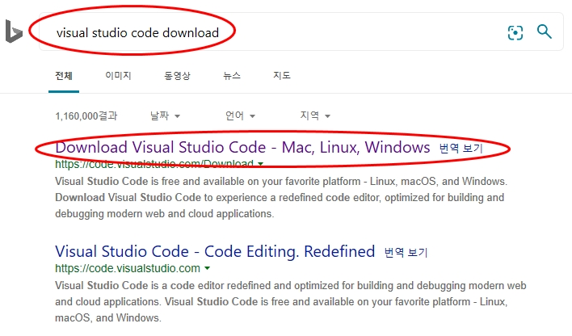
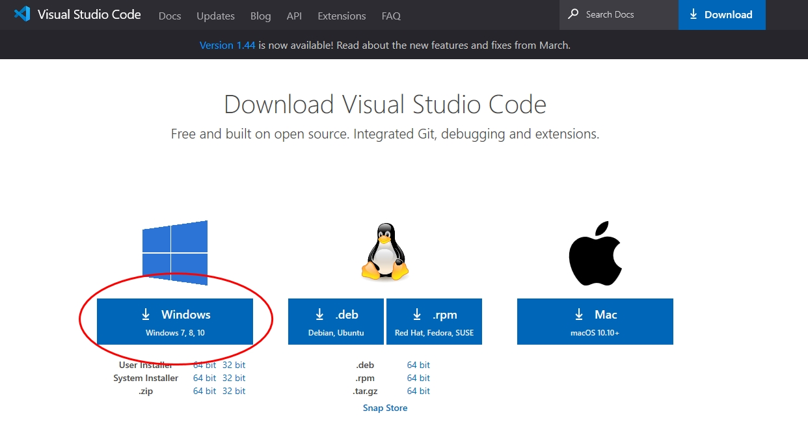

# git을 배워보자
## git 설치
### 1. [git-scm.com](http://git-scm.com) 이동하여 우측 중앙의 다운로드 버튼을 클
### 2. [github.com](http://github) 으로 이동한다.
### 3. 우측 상단의 **signyp** 버튼을 클릭한다.
### 4. 회원 가입을 완료하고 등록한 이메일로이동하여 velified) 버튼으 클릭하여 인증한다.

# visual studio code (VSCode)를 설치하자
## 다운로드
### 1. 구글에서 그림과 같이 선택해서 이동한다.

---
